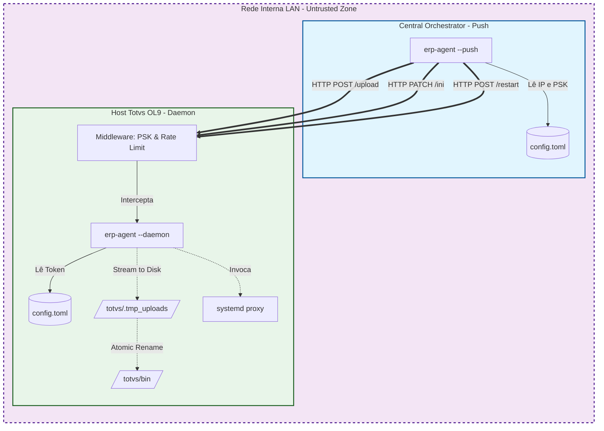

# Especificação Técnica: erp-agent (Orquestrador Totvs On-Premise)

- **Autores:** SPEC - Arquiteto SpecCraft
- **Status do Documento:** V1 - Consolidada e Travada para Desenvolvimento (Draft)
- **Histórico:**
  - `0.1`: PRD inicial.
  - `1.0`: endurecimento arquitetural, mitigação de I/O e injeção de comandos.
- **Nível ASVS alvo:** OWASP ASVS v4.0.3 - Nível 2.

## 1. Resumo executivo e escopo

### Contexto

O `erp-agent` é uma arquitetura cliente-servidor leve (push model) escrita em Rust, focada em determinismo, velocidade e proteção de estado para gestão de ambientes Totvs on-premise.

### Metas

- Deploy em binário único para modo push e daemon, selecionado por flags CLI.
- Transferência de arquivos pesados com resiliência estrutural e escrita atômica.
- Mutação idempotente de arquivos `.ini`, preservando credenciais e blocos preexistentes.
- Execução restrita de operações de sistema operacional, limitada a `systemctl`.

### Não-metas

- Banco de dados na fase 1.
- mTLS no MVP.
- Descoberta dinâmica de hosts.
- Auto-update em runtime sem reinício do daemon.

## 2. Matriz de requisitos

### 2.1 Requisitos funcionais e fronteiras

- **RF01 - Upload atômico:** o recebimento de binários deve ocorrer por stream para um arquivo temporário. Somente após validação do checksum SHA-256 o arquivo poderá ser promovido para o destino final com `fs::rename`.
- **RF02 - INI patching com lock:** a mutação de `.ini` deve adquirir exclusive file lock no sistema operacional antes de ler, alterar em memória e regravar o arquivo.
- **RF03 - Comando estrito:** reinício de serviços deve aceitar apenas IDs previamente cadastrados em `config.toml`, nunca strings arbitrárias vindas da rede.

### 2.2 Edge cases mapeados

- **EC01 - Upload interrompido (TCP RST):** limpeza automática de arquivos `.tmp` órfãos via rotina de descarte.
- **EC02 - Arquivo `.ini` ausente:** retorno de HTTP 404 estruturado; o daemon não cria configuração do zero.
- **EC03 - Timeout no `systemctl`:** execução com timeout de 30 segundos usando `tokio::process::Command`; o processo filho deve ser encerrado em caso de travamento.

### 2.3 Abuse cases e ameaças

- **AC01 - Path Traversal:** rejeitar caminhos fora do diretório base configurado, com validação canônica via `std::fs::canonicalize` e checagem estrita de prefixo.
- **AC02 - Command Injection:** bloquear strings arbitrárias para serviços; usar enum interno ou validação estrita com regex `^[a-zA-Z0-9_-]+$`.
- **AC03 - Brute force do PSK:** aplicar throttling ou rate limiting por IP após falhas consecutivas de autenticação.

### 2.4 Requisitos não funcionais

- **NFR-Perf:** parsing e serialização de `.ini` abaixo de 50ms no P99.
- **NFR-Memória:** daemon ocioso com RSS até 15MB; upload sem carregar o arquivo inteiro em memória.
- **NFR-Auditabilidade:** toda operação de I/O, falha de PSK ou mudança de estado do SO deve gerar log estruturado JSONL com timestamp UTC ISO-8601.

## 3. Topologia e design de API

### 3.1 Arquitetura e trust boundaries

### 3.2 Contratos de API

Todas as requisições exigem o header `X-ERP-Token`.

#### `POST /api/v1/upload`

- **Headers:** `X-ERP-Token`, `X-Target-Path`, `X-SHA256`
- **Body:** binary stream (`multipart/form-data` ou raw body)
- **Resposta:** `201 Created` ou `400 Bad Request` em caso de checksum inválido

#### `PATCH /api/v1/ini`

- **Payload:** `{ "file": "dbaccess.ini", "section": "Postgres", "key": "Thread", "value": "40" }`
- **Resposta:** `200 OK`, `304 Not Modified` ou `404 Not Found`

#### `POST /api/v1/restart`

- **Payload:** `{ "service_id": "totvs-appserver" }`
- **Resposta:** `200 OK` ou `500 Internal Server Error` com retorno controlado de falha

## 4. Segurança e resiliência

- **Atomicidade de arquivos:** todo upload usa escrita temporária seguida de `rename` nativo do SO para evitar exposição de artefatos parciais.
- **Isolamento de concorrência:** um mutex ou fila por arquivo alvo deve impedir race conditions em mutações concorrentes de `.ini`.
- **Princípio do menor privilégio:** o daemon deve executar como usuário Linux dedicado (`erp-agent`), com `sudo NOPASSWD` limitado a comandos absolutos de `systemctl` para serviços autorizados.
- **Redação de segredos em auditoria:** campos sensíveis, como senha, não podem aparecer em logs nem em modo debug; devem ser registrados como `[REDACTED]`.

## 5. Rollout, SRE e shift left

### 5.1 Pipeline CI/CD

Os quality gates mínimos que devem quebrar o build são:

- `cargo fmt --all -- --check`
- `cargo clippy -- -D warnings`
- `cargo audit`
- testes unitários cobrindo idempotência e preservação estrutural de `.ini`

### 5.2 Observabilidade segura

- Expor endpoint `/health` local ou autenticado com uptime e uso de memória.
- Rotacionar `/var/log/erp-agent/audit.jsonl` com `tracing-appender` para reduzir risco de disco cheio causado pela própria ferramenta.

## 6. Decision log (ADRs)

| ID | Data | Decisão | Contexto e trade-offs |
| --- | --- | --- | --- |
| ADR-01 | Hoje | Rust para CLI e daemon | Curva de aprendizado maior, mas com binário único portátil e memory safety. |
| ADR-02 | Hoje | PSK estática no MVP | Simplicidade operacional agora, aceitando ausência de forward secrecy. |
| ADR-03 | Hoje | Axum/Tokio em vez de threads síncronas | Maior complexidade assíncrona em troca de escalabilidade para múltiplos pushes simultâneos. |
| ADR-04 | Hoje | Patch de `.ini` via AST (`rust-ini`) | Mais pesado que `sed`/regex, porém estruturalmente seguro e previsível. |

## 7. Próximos passos recomendados

A sequência mais segura para implementação é:

1. **Módulo de validação atômica de arquivos (`upload + checksum + rename`)**: reduz o maior risco operacional do MVP porque trata corrupção, interrupção de rede, disco parcial e path traversal.
2. **Módulo de lock de `.ini`**: entra logo em seguida para proteger integridade de configuração e idempotência sob concorrência.
3. **Proxy restrito de `systemctl`**: somente após haver whitelist declarativa e timeout com observabilidade.

### Recomendação

Começar pelo módulo de upload atômico é a melhor prioridade técnica, pois ele concentra a maior superfície de falha catastrófica e precisa estabelecer os padrões de I/O seguro que os demais fluxos irão reutilizar.
